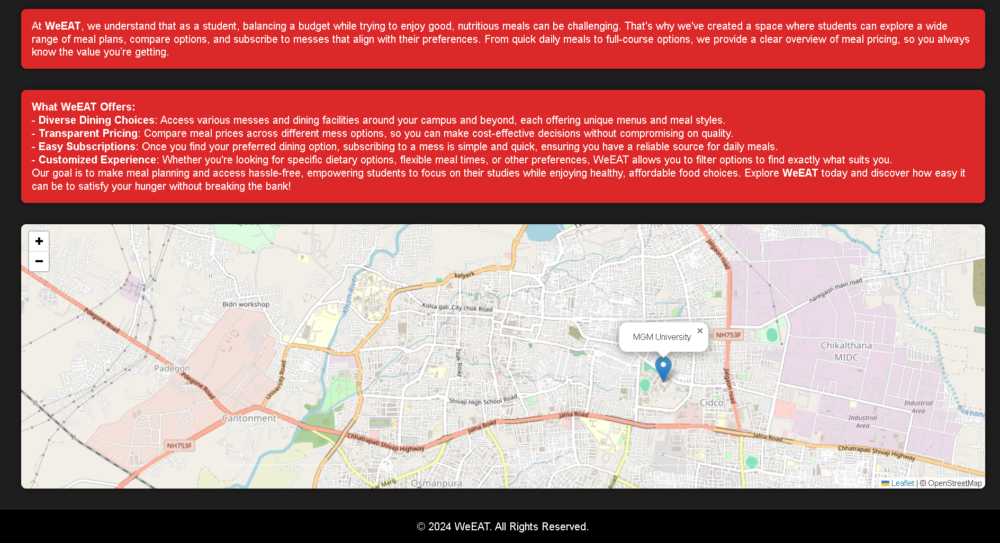
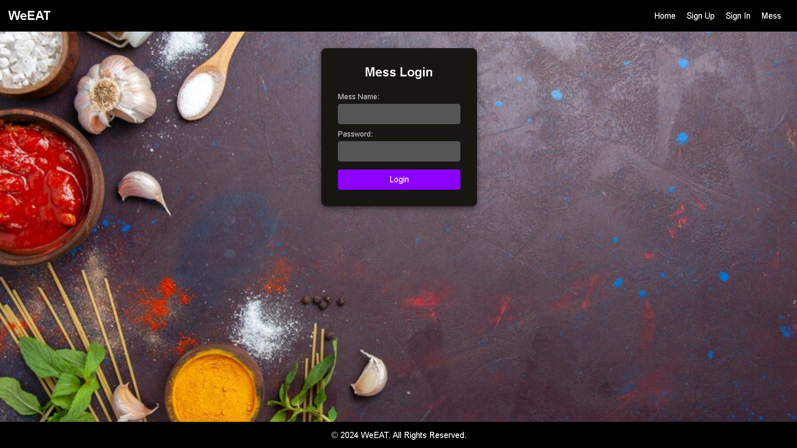
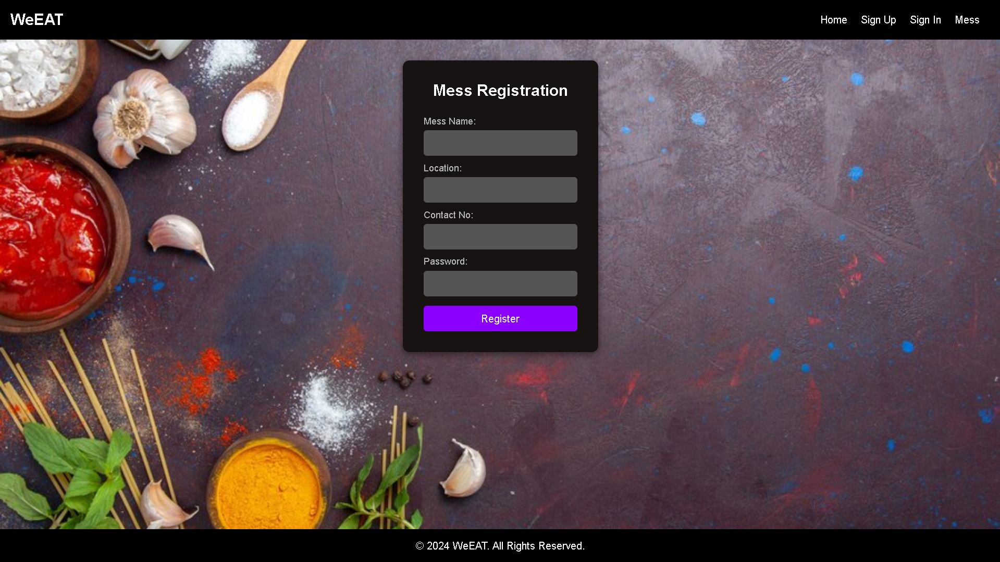
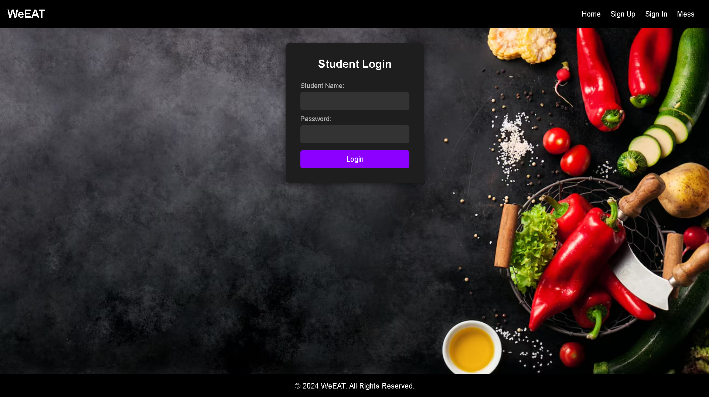
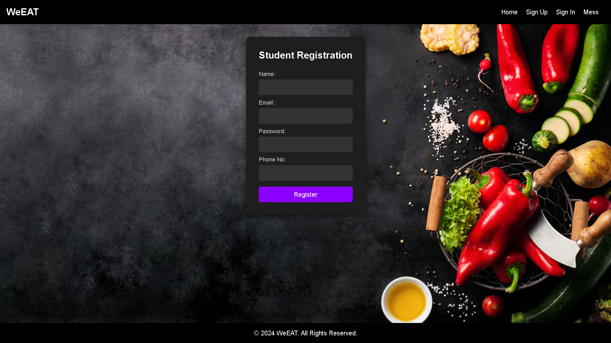
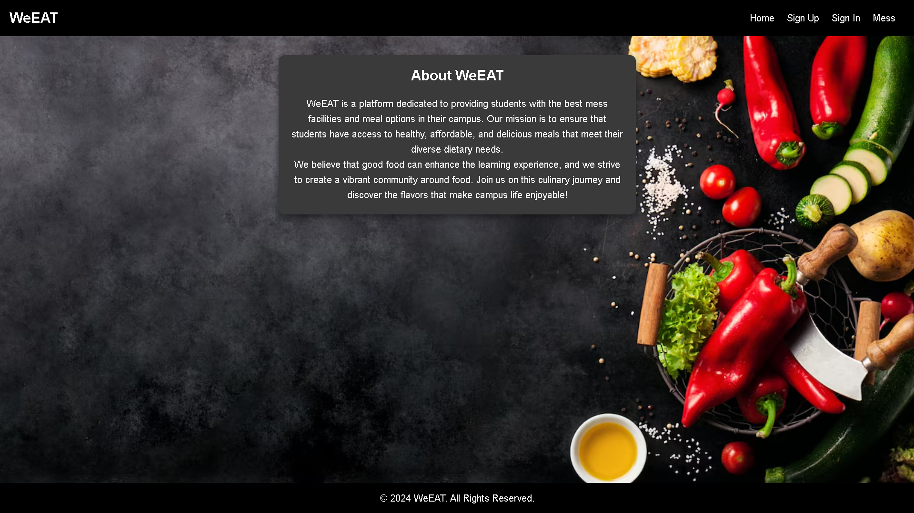

---


# WeEat 🍽️

**WeEat** is a personal Mess Food Ordering System project allowing mess owners and students to manage menus, orders, and subscriptions seamlessly. Built with Node.js backend, Bootstrap and HTML frontend, and MySQL database.

---

## 📌 Table of Contents

- [Tech Stack](#-tech-stack)
- [Features](#-features)
- [Installation & Setup](#-installation--setup)
- [Author](#-author)
- [License](#-license)
- [Screenshots](#-screenshots)

---

## 🛠️ Tech Stack

- **Frontend:** HTML, Bootstrap, CSS  
- **Backend:** Node.js  
- **Database:** MySQL  

---

## 🚀 Features

- Mess owner and student login & registration  
- Mess menu management  
- Student subscription and ordering  
- Responsive UI with Bootstrap  
- Secure data handling with MySQL  
- Personal project built from scratch  

---

## 📦 Installation & Setup

### 1. Clone the repository

```bash
git clone https://github.com/mahi02999/MessManagementSystem-WeEat-


````

### 2. Install dependencies

```bash
npm install
```

### 3. Setup MySQL database

* Create a MySQL database
* Import or run schema scripts (if any)
* Update database credentials in your config file

### 4. Run the server

```bash
node app.js
```

### 5. Open in browser

Navigate to:

```
http://localhost:3000
```

---

## 🙋‍♂️ Author

* **Mahi Bhavsar**
* 📧 [bhavsarmahi2004@gmail.com](mailto:bhavsarmahi2004@gmail.com)
* 🧑‍💻 [GitHub Profile](https://github.com/mahi02999)

---

## 📄 License

This project is for **personal** and **educational** use only. No commercial redistribution without permission.

---

## 🖼️ Screenshots

### Home Page




### Mess Owner Login & Register




### Student Login & Register




### About Page



---


